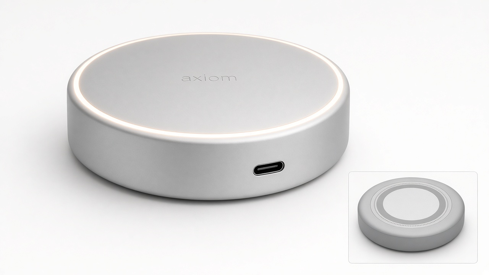
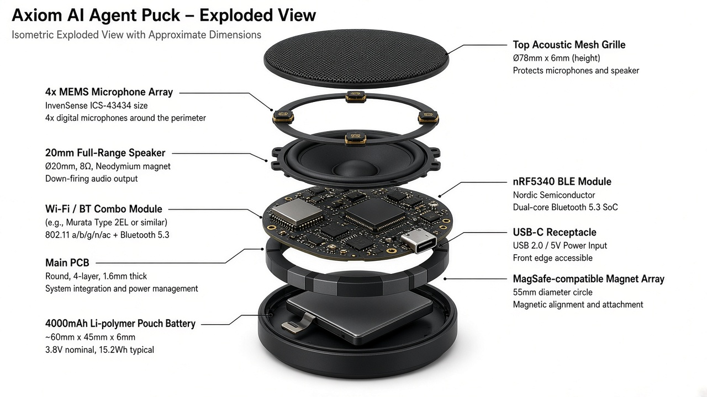

# axiom

**Always-on agent. Desk to pocket.**

[](./kickstarter/CAMPAIGN.md)
[](./brand/BRAND.md)
[](./site/index.html)

Matte aluminum · Ø78 × 28 mm · MagSafe underside · Flush USB-C · 4× MEMS mics · 20 mm speaker · nRF5340 + Wi-Fi/BT · Bluetooth HFP call bridging · iOS companion · ~½ day battery (~4000 mAh / ~15 Wh)

Founder: **Vaibhav Sharma** ([vaibhavjnf](https://github.com/vaibhavjnf)) · hackdomland@gmail.com  
Raise + Kickstarter · India + global

---

## What this repo is

Launch package for **Axiom** — product brand, spec, static landing page, investor pitch (markdown), Kickstarter draft, and outreach templates.  
No fabricated traction, users, or ship dates.

## Screenshots

| Hero | Exploded |
|------|----------|
|  |  |

## Quick links

| | |
|--|--|
| Landing page | [`site/index.html`](./site/index.html) (open locally — no build step) |
| Brand | [`brand/BRAND.md`](./brand/BRAND.md) · [`brand/logo.svg`](./brand/logo.svg) |
| Product spec | [`brand/PRODUCT_SPEC.md`](./brand/PRODUCT_SPEC.md) |
| Pitch deck | [`deck/PITCH.md`](./deck/PITCH.md) |
| Kickstarter draft | [`kickstarter/CAMPAIGN.md`](./kickstarter/CAMPAIGN.md) |
| Suppliers | [`outreach/SUPPLIERS.md`](./outreach/SUPPLIERS.md) |
| Investors | [`outreach/INVESTORS.md`](./outreach/INVESTORS.md) |

## Run the site

```bash
cd site
python3 -m http.server 8080
# open http://localhost:8080
```

Or open `site/index.html` directly in a browser (assets are copied into `site/`).

## Brand snap

- Wordmark: lowercase **axiom**
- BG `#F5F5F7` · text `#1D1D1F` · accent `#A1A1A6`
- Pillars: Harness / Voice / Presence / Continuity

## Status / contributing

**Status:** Pre-Kickstarter. Spec and brand locked for outreach. Hardware EVT not claimed complete in this repo.

**Contributing:** Not seeking public code contributions yet. For supplier or investor intros, email hackdomland@gmail.com. Do not submit invented contacts or fake metrics PRs.

## Legal

© Vaibhav Sharma / Axiom. MagSafe is a trademark of Apple Inc.; Axiom is not an Apple product.  
“Coming to Kickstarter” is not a shipping commitment.
